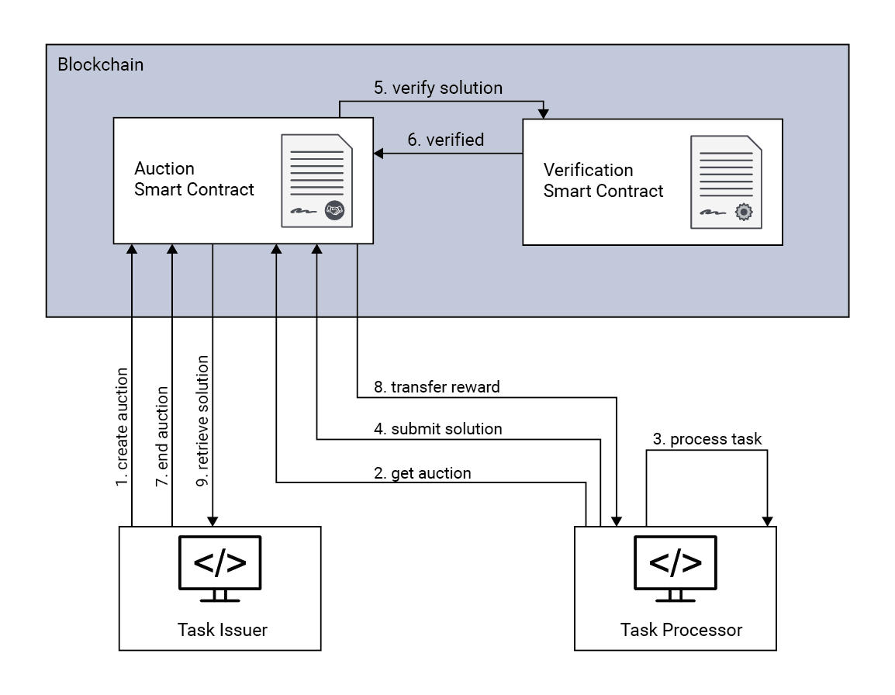

# Blockchain-based Computation Offloading

This is a blockchain-based computation offloading approach that allows arbitrary providers to rent out their computational resources for a fee. Task issuers can offload their tasks, without having to trust the provider carrying out the computation.

A result verification scheme is implemented so that it can be determined whether a result was computed properly. Thus, potential task issuers obtain a statement about the validity of solutions to their corresponding task. We use zk-SNARKs to employ result verification, because

- Proofs are short and a verifier can be convinced with a single message.
- The verification of a proof does not depend on the problem's complexity.

By using a blockchain as the underlying infrastructure we dissolve the dependency on a single organization. Further, to enhance competition between task processors and to offer task issuers the best possible solution, an auction-based mechanism is integrated.

In short, our goals are

- The assignment of resources and the processing of payments have to be done with the help of blockchain technology.
- Off-chain computations have to be verified on-chain. The result verification effort has to be independent of the complexity of an offloaded task.
- NP-complete problems are potentially hard to compute. For larger problem instances, it is unknown whether the optimal solution can be found in polynomial time. An auction-based mechanism that allows to submitting multiple results per task, e.g., computed utilizing heuristics would be beneficial.

## System Overview

## Use Case

- We use the Traveling Salesperson Problem (TSP) as an exemplary use case for our reference implementation.
- A task issuer can create an auction containing cities that have to be visited.
- Task processors compute a path and a cryptographic proof to attest a proper computation. The path, the proof, and a quality criteria are written back on the blockchain.

# Getting Started
We have used the <a href="https://www.trufflesuite.com/">Truffle Suite</a> to deploy our offloading approach to a local Ethereum blockchain. Besides Truffle, the toolbox <a href="https://github.com/Zokrates/ZoKrates">ZoKrates</a> is leveraged to employ zk-SNARKs on the blockchain. Our implementation has been tested with ZoKrates v0.5.1, v0.5.2, and v0.5.3. ZoKrates provides a Docker container. To run our offloading solution locally, please consider the following steps:

1. Install <a href="https://www.trufflesuite.com/truffle">Truffle</a> and <a href="https://www.trufflesuite.com/ganache">Ganache</a>
2. Download and run our <a href="https://hub.docker.com/r/dockerbee256/dt_test_zokrates">customized ZoKrates Docker container</a>
3. Deploy the auction and verification smart contracts of our solution on the local Ethereum blockchain
4. Set the verification smart contract addresses within the auction smart contract by calling `auctionSmartcontract.setVerifyAddress(<numberOfCities>, <address>)`
5. Start offloading a task by creating an auction

## Example

In the following, an exemplary offloading cycle in the context of our reference implementation is outlined. All commands are executed within the `truffle console`.

Preparation steps:

    let auction = await AuctionConstant.deployed();
    let vc10 = await VCC10M30M70.deployed();
    let acc = await web3.eth.getAccounts();
    let va10 = await auction.setVerifyAddress(10, vc10.address);

Task issuer A wants to visit Amsterdam, Antwerp and Athens. Therefore an according auction is created:

    let cities = ["Amsterdam", "Antwerp", "Athens"];
    cities = cities.map(function(v){return web3.utils.fromUtf8(v);});
    let cre = await auction.createAuction(cities, true, {from: acc[1], value: web3.utils.toWei('0.01', 'ether')});

Task processor B wants to participate and retrieves the current auction. Then, B computes a path locally. The computed path (Amsterdam -> Antwerp -> Athens) is based on map number 30 and has a length of 6008 km:

    let task = auction.getTask();
    let path = [0, 1, 2, 30, 30, 30, 30, 30, 30, 30];
    let map = 30;
    let length = 6008;

Now the task processor has to create a proof, e.g, with our docker container. Here, the paramters `<path> <mapNumber> <cities> <length> <hasOfCities> <hashOfPath>` are necessary.:

    ./zokrates compute-witness -i tspCC10M30M70/out -a  0 1 2 30 30 30 30 30 30 30 30 0 1 2 30 30 30 30 30 30 30 6008 268046837323191409535190519762868641145 199370613785650609151521546970367548903 268046837323191409535190519762868641145 199370613785650609151521546970367548903

     ./zokrates generate-proof -i tspCC10M30M70/out -p tspCC10M30M70/proving.key

ZoKrates generates a file `proof.json` containing four arrays. The first three arrays represent three elliptic curve points that make the zk-SNARKs proof and are necessary for the result verification and submission. Therefore, we store the elliptic curve points and the values of the hashed path and cities in local variables:

    let a = ["0x15fce784a19361b110aeb136bb382ba8548577533094288a860c3145959dec05", "0x135db2bd9c789f0f19effccd11edc12c97665247ae031fd46bfbecc54d7f79af"];
    let b = [["0x02c8e4005c0f0c69de8fb8121d49133999746f5a16f4f1ef9c600ef7dc1fe930", "0x184e2a6ffe006ad538ac08f0b69418da1a32f55a0b52be200276b85713139ae8"], ["0x27ff2db62f585b5e0b47ab1cce7eb9dabaff9a3b481018df5b8a2d9ca11d136a", "0x28269dfdffa2b1fbfb77dd093f020b8c0769f9ebfdd923f8e0a225fe47d07312"]];
    let c = ["0x293943de6da96a2276ff3907cc90e7ea2eb311ca94a5ff799494a57557a25987", "0x0fe1be5243a7c359203b06999e43d2e3f58a0c66d2cb5f9655bfb4e37b57abde"];

    let hp = [web3.utils.toBN('268046837323191409535190519762868641145'), web3.utils.toBN('199370613785650609151521546970367548903')];
    let hc = [web3.utils.toBN('268046837323191409535190519762868641145'), web3.utils.toBN('199370613785650609151521546970367548903')];

In the next step, task processor B can submit the solution:

    let sub = await auction.submitSolutionVerifiable(a, b[0], b[1], c, path, map, length, hc, hp, {from: acc[5]});

After some time task processor C noticed the running auction and is interested to participate. C retrieves relevant data of the auction and the quality criteria of the currently best result. C decides not to participate because its computed path is not shorter.

    auction.getTask();
    (await auction.getShortestSolution()).toNumber();

Task issuer A ends the auction and retrieves the result with the best quality criteria, i.e. the path length. By ending an auction the task processor with the winning result gets paid (with the stake).

    let end = await auction.endAuction();
    let result = await auction.retrieveSolution({from:acc[1]});